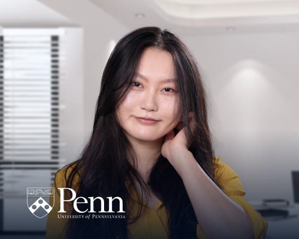
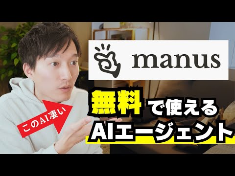

# 🌟 AI Rockstars - AI Agent 领域杰出人物 / Outstanding Figures in AI Agent Field

> 汇聚全球AI Agent领域的杰出人物与思想领袖，分享他们的洞察与贡献  
> A collection of outstanding figures and thought leaders in the global AI Agent field, sharing their insights and contributions

## 📖 项目简介 / Project Overview

**中文简介**  
AI Rockstars 是一个专注于AI Agent领域杰出人物的知识分享平台。我们致力于记录和展示全球范围内在AI Agent技术、研究、教育和应用方面做出重要贡献的专家学者、技术领袖和创新者。通过深入的人物档案和专业洞察，帮助社区了解这个快速发展领域的关键人物及其贡献。

**English Introduction**  
AI Rockstars is a knowledge-sharing platform focused on outstanding figures in the AI Agent field. We are dedicated to documenting and showcasing experts, technical leaders, and innovators worldwide who have made significant contributions to AI Agent technology, research, education, and applications. Through in-depth profiles and professional insights, we help the community understand key figures and their contributions in this rapidly evolving field.

## 🎯 项目目标 / Project Goals

### 中文目标
- **知识传播**: 分享AI Agent领域专家的研究成果和技术洞察
- **社区建设**: 连接全球AI Agent研究者和实践者
- **教育资源**: 为学习者提供权威的学习参考和指导
- **行业洞察**: 追踪AI Agent技术发展趋势和未来方向

### English Goals
- **Knowledge Dissemination**: Share research achievements and technical insights from AI Agent experts
- **Community Building**: Connect global AI Agent researchers and practitioners
- **Educational Resources**: Provide authoritative learning references and guidance for learners
- **Industry Insights**: Track AI Agent technology trends and future directions

## 🌍 全球杰出人物 / Global Outstanding Figures

### 🏆 S级贡献者 / S-Tier Contributors

#### Andrew Ng - AI教育先驱 / AI Education Pioneer

**中文介绍**  
Andrew Ng是全球AI教育的先驱者，Stanford大学教授，Coursera联合创始人，DeepLearning.AI创始人。他在机器学习和AI教育领域做出了卓越贡献，特别是在Agentic AI方面的最新研究引领了行业发展方向。

**English Introduction**  
Andrew Ng is a global pioneer in AI education, Stanford University professor, co-founder of Coursera, and founder of DeepLearning.AI. He has made outstanding contributions to machine learning and AI education, particularly his latest research in Agentic AI leading industry development directions.

**核心贡献 / Key Contributions:**
- 🎓 创建了全球最大的在线AI教育平台
- 🔬 在Agentic AI领域的前沿研究
- 📚 发表了大量具有影响力的学术论文
- 🌐 培养了数百万AI学习者

**社交媒体影响力 / Social Media Influence:**
- X.com: [@AndrewYNg](https://x.com/AndrewYNg) - 208万关注者
- LinkedIn: [andrewyng](https://linkedin.com/in/andrewyng) - 208万关注者
- YouTube: [@Deeplearningai](https://youtube.com/@Deeplearningai) - 50万订阅者

---

#### Tina Huang - 数据科学教育家 / Data Science Educator

**中文介绍**  
Tina Huang是前Meta数据科学家，现为知名的AI和数据科学教育者。她通过YouTube平台分享实用的AI工具使用技巧和职业发展建议，在技术社区享有很高声誉。

**English Introduction**  
Tina Huang is a former Meta data scientist and now a renowned AI and data science educator. She shares practical AI tool usage tips and career development advice through her YouTube platform, enjoying high reputation in the tech community.

**核心贡献 / Key Contributions:**
- 💼 Meta公司数据科学实战经验分享
- 🎥 制作高质量的AI教育视频内容
- 🛠️ 实用AI工具和技术的深度解析
- 👩‍💻 为技术人员提供职业发展指导

**社交媒体影响力 / Social Media Influence:**
- YouTube: [@TinaHuang1](https://youtube.com/@TinaHuang1) - 90.1万订阅者
- LinkedIn: [tina-huang](https://linkedin.com/in/tina-huang) - 10万关注者

---

#### KEITO - AI工具专家 / AI Tools Expert

**中文介绍**  
KEITO是日本知名的AI工具专家和Web开发者，专注于AI Agent工具的实际应用和教学。他的YouTube频道为日本AI社区提供了宝贵的技术资源和实践指导。

**English Introduction**  
KEITO is a renowned AI tools expert and web developer from Japan, focusing on practical applications and teaching of AI Agent tools. His YouTube channel provides valuable technical resources and practical guidance for the Japanese AI community.

**核心贡献 / Key Contributions:**
- 🔧 AI Agent工具的深度测评和使用指南
- 🌐 Web开发与AI技术的结合应用
- 🎌 推动AI技术在日本市场的普及
- 📹 制作详细的AI工具教程视频

**社交媒体影响力 / Social Media Influence:**
- YouTube: [@KEITO_AI_WEB](https://youtube.com/@KEITO_AI_WEB) - 14.8万订阅者
- X.com: [@keito_ai_web](https://x.com/keito_ai_web) - 2万关注者

---

### 🌟 A级贡献者 / A-Tier Contributors

#### Patricia Scanlon - AI政策专家 / AI Policy Expert

**中文介绍**  
Patricia Scanlon博士是爱尔兰首位AI大使，SoapBox Labs创始人兼CEO。她在AI伦理、政策制定和儿童语音技术方面具有深厚专业知识，是AI治理领域的权威专家。

**English Introduction**  
Dr. Patricia Scanlon is Ireland's first AI Ambassador and founder & CEO of SoapBox Labs. She has deep expertise in AI ethics, policy making, and children's speech technology, and is an authoritative expert in AI governance.

**核心贡献 / Key Contributions:**
- 🏛️ 制定AI政策和伦理标准
- 👶 开发儿童语音识别技术
- 🌍 推动AI技术的负责任发展
- 📜 参与国际AI治理框架建设

---

#### Clément Delangue - 开源AI领袖 / Open Source AI Leader

**中文介绍**  
Clément Delangue是Hugging Face的联合创始人兼CEO，Time杂志2023年AI最具影响力人物。他领导着全球最大的开源AI平台，推动AI技术的民主化发展。

**English Introduction**  
Clément Delangue is co-founder and CEO of Hugging Face, named one of Time Magazine's most influential AI figures in 2023. He leads the world's largest open-source AI platform, promoting the democratization of AI technology.

**核心贡献 / Key Contributions:**
- 🤗 建立全球最大的开源AI模型平台
- 🌐 推动AI技术的开放和民主化
- 🔬 支持AI研究社区的发展
- 💡 促进AI技术的创新和应用

---

## 📚 详细档案 / Detailed Profiles

每位杰出人物都有详细的个人档案，包含：
Each outstanding figure has a detailed profile including:

- 📋 **个人背景** / Personal Background
- 🎓 **教育经历** / Educational Background  
- 💼 **职业成就** / Professional Achievements
- 🔬 **技术贡献** / Technical Contributions
- 📱 **社交媒体** / Social Media Presence
- 🌟 **影响力分析** / Influence Analysis

### 档案目录 / Profile Directory

#### 北美地区档案 / North America Profiles

#### 东亚地区档案 / East Asia Profiles  

#### 欧洲地区档案 / Europe Profiles

#### 其他地区档案 / Other Regions Profiles

{{ include "profiles/other/张涛.md" }}
{{ include "profiles/other/季逸超.md" }}
{{ include "profiles/other/evan-reiser:-abnormal-security-联合创始人兼ceo.md" }}
{{ include "profiles/other/sanjay-jeyakumar:-abnormal-security-联合创始人.md" }}
{{ include "profiles/other/harrison-chase:-langchain-创始人.md" }}
{{ include "profiles/other/munjal-shah:-hippocratic-ai-联合创始人.md" }}
{{ include "profiles/other/景鲲:-genspark-创始人.md" }}
{{ include "profiles/other/曼尼·梅迪纳（manny-medina）:-paid-创始人，outreach-联合创始人兼前ceo.md" }}
{{ include "profiles/other/周衔:-genesis-创始人及ceo.md" }}
{{ include "profiles/other/胡世超:-璇星科技ceo.md" }}
{{ include "profiles/other/刘晓春:-言创万物联合创始人及coo.md" }}
{{ include "profiles/other/王冠:-one2x-ceo.md" }}
{{ include "profiles/other/李广密:-拾象科技ceo.md" }}
{{ include "profiles/other/roman-chernin:-nebius-co-founder-&-cbo.md" }}
{{ include "profiles/other/xiyue-xiang:-amd资深首席工程师，前-sambanova-高级工程经理.md" }}
{{ include "profiles/other/echo-zhong:-kick-founding-head-of-tax.md" }}
{{ include "profiles/other/laura-lin:-collov-ai-head-of-growth-&-community.md" }}
{{ include "profiles/other/waylon-ming:-omnify-labs-founder.md" }}
{{ include "profiles/other/黄子琪:-2025苹果ai学者，研究领域.md" }}
{{ include "profiles/other/孔令东:-2025苹果ai学者，研究领域.md" }}
{{ include "profiles/other/吉嘉铭:-2025苹果ai学者，研究领域.md" }}
{{ include "profiles/other/顾煜贤:-2025苹果ai学者，研究领域.md" }}
{{ include "profiles/other/ruei-che-chang:-2025苹果ai学者，研究领域.md" }}
{{ include "profiles/other/cathy-mengying-fang:-2025苹果ai学者，研究领域.md" }}
{{ include "profiles/other/王广辉:-2025苹果ai学者，研究领域.md" }}
{{ include "profiles/other/谢若宇:-2025苹果ai学者，研究领域.md" }}
{{ include "profiles/other/李珎:-replit-ai-团队负责-ai-coding-agent，ex--startup-创始人,-ex--googler.md" }}
{{ include "profiles/other/姚顺雨:-普林斯顿大学博士，agent-领域研究员，swe-bench-和-swe-agent-项目发起人.md" }}
{{ include "profiles/other/赵宇哲:-augment-ai-研究员，ex-google-deepmind.md" }}
{{ include "profiles/other/周志峰:-启明创投主管合伙人，ai-agent领域投资人.md" }}
{{ include "profiles/other/高莘:-电子科技大学，研究方向.md" }}
{{ include "profiles/other/王仲远:-百度集团副总裁、深度学习技术及应用国家工程研究中心副主任，研究方向.md" }}
{{ include "profiles/other/刘康:-中国科学院自动化研究所研究员，研究方向.md" }}
{{ include "profiles/other/张鹏:-腾讯游戏ai平台部总经理，研究方向.md" }}
{{ include "profiles/other/张梅:-清华大学智能产业研究院助理研究员，研究方向.md" }}
{{ include "profiles/other/李国豪:-中英人工智能协会，研究方向.md" }}
{{ include "profiles/other/程絮森:-教授，研究方向.md" }}
{{ include "profiles/other/david-luan:-adept-ceo.md" }}
{{ include "profiles/other/ashish-vaswani:-adept-联合创始人兼首席科学家.md" }}
{{ include "profiles/other/niki-parmar:-adept-cto.md" }}
{{ include "profiles/other/李强:-奇绩创坛创业顾问.md" }}
{{ include "profiles/other/邵帅:-奇绩创坛路演项目创始人/ceo.md" }}
{{ include "profiles/other/斯里尼瓦斯·纳拉扬（srinivas-narayanan）:-openai-负责chatgpt-和各代模型的api-搭建的工程工作.md" }}
{{ include "profiles/other/杨鸿城:-奇绩创坛路演项目创始人/ceo.md" }}
{{ include "profiles/other/daniel-de-freitas:-谷歌brain大模型lamda前负责人.md" }}
{{ include "profiles/other/noam:-transformer八位作者之一.md" }}
{{ include "profiles/other/jesse-zhang:-11x.ai-ceo.md" }}
{{ include "profiles/other/karol-hausman:-pi-ceo.md" }}

## 🤝 贡献指南 / Contributing Guidelines

### 中文贡献指南
我们欢迎社区贡献！如果您知道其他在AI Agent领域有重要贡献的人物，请：

1. Fork 本项目
2. 创建新的人物档案文件
3. 添加高质量的个人照片
4. 提交 Pull Request

### English Contributing Guidelines
We welcome community contributions! If you know other important figures in the AI Agent field, please:

1. Fork this project
2. Create new profile files
3. Add high-quality portrait photos
4. Submit a Pull Request

### 档案标准 / Profile Standards

每个档案应包含 / Each profile should include:
- ✅ **个人基本信息** / Basic personal information
- ✅ **教育和职业背景** / Educational and professional background
- ✅ **主要技术贡献** / Major technical contributions
- ✅ **社交媒体链接** / Social media links
- ✅ **高质量头像照片** / High-quality portrait photo

## 📄 许可证 / License

本项目采用 MIT 许可证 - 查看 [LICENSE](LICENSE) 文件了解详情。  
This project is licensed under the MIT License - see the [LICENSE](LICENSE) file for details.

## 🙏 致谢 / Acknowledgments

感谢所有为AI Agent领域发展做出贡献的杰出人物，以及支持本项目的社区成员。  
Thanks to all outstanding figures who have contributed to the development of the AI Agent field, and community members who support this project.

---

**最后更新 / Last Updated**: 2025年6月22日 / June 22, 2025  
**项目维护者 / Project Maintainer**: [ccc7574](https://github.com/ccc7574)

---

*本项目致力于促进AI Agent领域的知识分享与交流，如有任何建议或意见，欢迎通过 Issues 与我们联系。*
*This project is dedicated to promoting knowledge sharing and communication in the AI Agent field. For any suggestions or feedback, please contact us through Issues.*
