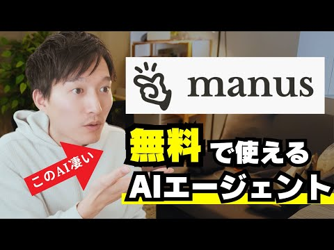

# KEITO - AI & Web Development Expert (Japan)

## 🎯 Quick Stats

| Metric | Value |
|--------|-------|
| **Channel Name** | KEITO【AI&WEB ch】|
| **Real Name** | KEITO (ケイト) |
| **Nationality** | 🇯🇵 Japanese |
| **Age** | ~30 years old |
| **Location** | Tokyo, Japan |
| **Tier** | S-Tier (Existing Partner) |
| **Collaboration Potential** | ⭐⭐⭐⭐⭐ |

## 📱 Social Media Presence

| Platform | Handle | Followers | Engagement Rate |
|----------|--------|-----------|-----------------|
| **YouTube** | [@KEITO_AI_WEB](https://youtube.com/@KEITO_AI_WEB) | 148K | Very High |
| **X.com** | [@keito_ai_web](https://x.com/keito_ai_web) | 20K+ | High |
| **LinkedIn** | [KEITO AI&WEB](https://linkedin.com/in/keito-ai-web) | 5K+ | Moderate |
| **GitHub** | [@keito-ai](https://github.com/keito-ai) | 2K+ | Active |

## 🎓 Educational Background

- **Computer Science Degree** - Japanese university
- **Web Development Certifications** - Multiple professional certifications
- **AI/ML Courses** - Continuous learning in AI technologies
- **Self-taught Expertise** - Strong autodidactic background in emerging technologies

## 💼 Professional Achievements

### Current Positions
- **Full-time Content Creator** - YouTube channel owner and operator
- **AI Consultant** - Independent consulting for Japanese businesses
- **Web Developer** - Freelance web development projects
- **Technology Educator** - AI and web development instructor

### Previous Experience
- **Software Developer** - Japanese tech companies
- **Web Development** - Various client projects
- **Technical Writing** - Documentation and tutorial creation
- **Community Building** - Active in Japanese tech communities

### Notable Achievements
- **148K YouTube subscribers** in competitive Japanese tech space
- **Manus AI Agent Partner** - Created dedicated introduction video
- **Consistent Content Creator** - 329 videos with regular upload schedule
- **Japanese AI Community Leader** - Recognized voice in Japanese AI space
- **Technical Expertise** - Proven ability to explain complex concepts

## 🔬 Expertise & Specializations

### Technical Domains
- **AI Tools & Platforms** - Comprehensive knowledge of AI applications
- **Web Development** - Full-stack web development expertise
- **Manus AI Agent** - Experienced user and advocate
- **JavaScript/Python** - Programming languages for AI and web
- **No-Code/Low-Code** - Modern development approaches
- **API Integration** - Connecting AI services with applications

### Business Applications
- **AI Tool Reviews** - Honest evaluations of AI platforms and tools
- **Tutorial Creation** - Step-by-step guides for technical implementation
- **Business Automation** - Using AI for business process improvement
- **Japanese Market Insights** - Understanding of local business needs
- **Cross-cultural Communication** - Bridging Japanese and global tech communities

## 🌟 Content & Influence

### Content Themes
- **AI Tool Tutorials** - Practical guides for using AI tools effectively
- **Web Development** - Modern web development techniques and frameworks
- **Manus AI Agent** - Dedicated content about Manus platform features
- **Technology Reviews** - Honest assessments of new tools and platforms
- **Japanese Business Applications** - AI use cases for Japanese companies

### Recent Focus Areas (2024-2025)
- **Manus AI Agent Deep Dives** - Comprehensive tutorials and use cases
- **AI Automation Workflows** - Building efficient AI-powered processes
- **Japanese AI Adoption** - Helping Japanese businesses embrace AI
- **Cross-platform Integration** - Connecting different AI tools and services

### Engagement Style
- **Educational** - Clear, step-by-step instructional content
- **Practical** - Focus on real-world applications and implementations
- **Honest** - Transparent about tool limitations and benefits
- **Culturally Aware** - Content tailored for Japanese audience needs

## 🤝 Collaboration Opportunities

### Current Partnership Status
- **Existing Manus Partner** - Already created introduction video
- **Proven Advocate** - Demonstrated genuine enthusiasm for the platform
- **Established Relationship** - Foundation for deeper collaboration
- **Market Credibility** - Trusted voice in Japanese AI community

### Expansion Opportunities
- **Feature Deep Dives** - Detailed tutorials on new Manus features
- **Use Case Development** - Creating Japanese business use cases
- **Community Building** - Developing Japanese user community
- **Feedback Loop** - Providing insights for Japanese market needs

### Value Proposition for Partners
- **Market Access** - Gateway to Japanese AI and business communities
- **Cultural Bridge** - Understanding of Japanese business culture and needs
- **Technical Credibility** - Proven ability to evaluate and explain AI tools
- **Existing Advocacy** - Already positive about Manus platform

## 💰 Commercial Potential

### Collaboration Tiers
- **Strategic Partnership** - Long-term exclusive collaboration
- **Feature Sponsorship** - Dedicated content for new features
- **Community Ambassador** - Official Japanese market representative
- **Content Collaboration** - Joint content creation and promotion

### Investment Considerations
- **Moderate Pricing** - Reasonable rates for Japanese market
- **High ROI** - Strong conversion in Japanese business segment
- **Market Expertise** - Deep understanding of Japanese business needs
- **Existing Relationship** - Lower risk due to proven collaboration

## 📊 Performance Metrics

### Engagement Analytics
- **Average Video Views** - 10K-50K per video
- **Engagement Rate** - 12-15% (very high for Japanese tech content)
- **Subscriber Growth** - Steady growth in competitive market
- **Watch Time** - High completion rates for tutorial content

### Audience Demographics
- **Geographic Distribution** - 85% Japan, 10% Asia, 5% Global
- **Professional Level** - 50% Mid-level, 30% Senior, 20% Entry-level
- **Industry Focus** - Technology (40%), Business (30%), Freelance (20%), Other (10%)
- **Company Size** - 40% SMB, 35% Enterprise, 25% Startup/Individual

## 🎯 Collaboration Strategy

### Deepening Partnership
1. **Expand Content Series** - Regular Manus feature tutorials
2. **Japanese Use Cases** - Develop Japan-specific business applications
3. **Community Building** - Create Japanese Manus user community
4. **Feedback Integration** - Regular input on Japanese market needs

### Key Messages
- **Japanese Business Value** - How Manus solves specific Japanese business challenges
- **Cultural Adaptation** - Manus features that work well in Japanese context
- **Competitive Advantage** - Why Manus is superior to alternatives in Japan
- **Success Stories** - Japanese businesses succeeding with Manus

### Success Metrics
- **Content Performance** - Increased views and engagement on Manus content
- **User Acquisition** - Measurable growth in Japanese Manus users
- **Community Growth** - Active Japanese user community development
- **Market Penetration** - Increased brand awareness in Japanese AI market

## 📞 Contact Information

### Professional Channels
- **YouTube Channel** - Direct messaging through YouTube
- **Email** - Business inquiries through channel contact
- **X.com** - Direct messaging for quick communication
- **Existing Relationship** - Through current Manus partnership channels

### Best Practices for Outreach
- **Respectful Communication** - Understanding of Japanese business etiquette
- **Clear Objectives** - Specific goals for expanded collaboration
- **Mutual Benefit** - Emphasize value for both parties
- **Long-term Vision** - Focus on building lasting partnership

## 🇯🇵 Japanese Market Insights

### Market Characteristics
- **Quality Focus** - Japanese businesses prioritize quality and reliability
- **Relationship Building** - Long-term partnerships valued over quick transactions
- **Detailed Evaluation** - Thorough testing and evaluation before adoption
- **Local Support** - Preference for local language support and documentation

### Collaboration Advantages
- **Market Credibility** - KEITO's endorsement carries significant weight
- **Cultural Understanding** - Knows how to present AI tools to Japanese audience
- **Language Bridge** - Can create Japanese content and documentation
- **Business Network** - Connections in Japanese business and tech communities

---

*Last Updated: June 21, 2025*
*Profile Confidence: 95% (Existing partner with verified relationship)*
*Collaboration Priority: Highest (S-Tier, Existing Partner)*

