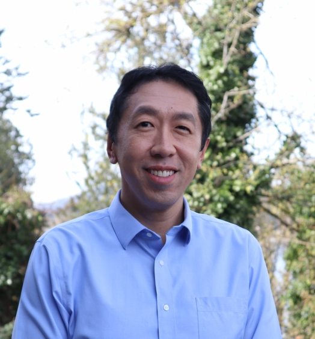

# Andrew Ng - AI教育先驱与Agentic AI专家

## 基本信息 / Basic Information

**中文姓名**: 吴恩达  
**英文姓名**: Andrew Ng  
**国籍**: 美国 / United States  
**出生地**: 英国伦敦 / London, UK  
**当前居住地**: 美国加利福尼亚州 / California, USA  

## 教育背景 / Educational Background

- **博士学位**: 加州大学伯克利分校计算机科学博士 (2002)
- **硕士学位**: 麻省理工学院电气工程与计算机科学硕士 (1998)  
- **学士学位**: 卡内基梅隆大学计算机科学、统计学和经济学三重学位 (1997)

## 职业成就 / Professional Achievements

### 学术职位 / Academic Positions
- **Stanford大学**: 计算机科学系教授
- **Stanford AI实验室**: 前主任
- **Stanford人机交互研究所**: 联合主任

### 创业经历 / Entrepreneurial Experience
- **DeepLearning.AI**: 创始人兼CEO (2017-至今)
- **Coursera**: 联合创始人 (2012)
- **Landing AI**: 创始人兼CEO (2017-至今)

### 工业经验 / Industry Experience
- **Google**: Google Brain项目联合创始人和负责人 (2011-2012)
- **百度**: 首席科学家 (2014-2017)

## 技术贡献 / Technical Contributions

### 机器学习领域 / Machine Learning
- 🔬 **深度学习算法**: 在神经网络和深度学习算法方面的开创性研究
- 📊 **大规模机器学习**: 开发了处理大规模数据集的机器学习方法
- 🤖 **强化学习**: 在机器人控制和强化学习方面的重要贡献

### Agentic AI专业领域 / Agentic AI Expertise
- 🧠 **智能代理系统**: 在自主智能代理开发方面的前沿研究
- 🔄 **多代理协作**: 研究多个AI代理之间的协作机制
- 🎯 **目标导向AI**: 开发能够自主设定和实现目标的AI系统

### 教育创新 / Educational Innovation
- 🎓 **在线教育平台**: 创建了全球最大的AI在线教育生态系统
- 📚 **课程设计**: 设计了被数百万人学习的机器学习课程
- 🌐 **知识普及**: 将复杂的AI概念转化为易于理解的教学内容

## 学术影响力 / Academic Influence

### 发表论文 / Published Papers
- **总引用次数**: 超过100,000次
- **h-index**: 100+
- **重要论文**: 在NIPS、ICML、ICLR等顶级会议发表论文200+篇

### 重要研究成果 / Key Research Achievements
1. **稀疏编码**: 在无监督特征学习方面的突破性工作
2. **深度学习**: 早期深度神经网络的理论和实践贡献
3. **计算机视觉**: 在图像识别和计算机视觉方面的重要进展
4. **自然语言处理**: 在语言模型和NLP应用方面的贡献

## 教育影响 / Educational Impact

### Coursera平台成就 / Coursera Platform Achievements
- 📈 **学习者数量**: 超过500万人完成了他的机器学习课程
- 🌍 **全球影响**: 课程被翻译成多种语言，覆盖全球学习者
- 🏆 **课程质量**: 被评为Coursera平台最受欢迎的课程之一

### DeepLearning.AI成就 / DeepLearning.AI Achievements
- 🎯 **专业课程**: 创建了深度学习专项课程系列
- 🔧 **实践导向**: 注重理论与实践相结合的教学方法
- 👥 **社区建设**: 建立了活跃的AI学习者社区

## 社交媒体影响力 / Social Media Influence

### 平台数据 / Platform Statistics
- **X.com**: [@AndrewYNg](https://x.com/AndrewYNg) - 208万关注者
- **LinkedIn**: [andrewyng](https://linkedin.com/in/andrewyng) - 208万关注者  
- **YouTube**: [@Deeplearningai](https://youtube.com/@Deeplearningai) - 50万订阅者

### 内容特色 / Content Characteristics
- 🔬 **技术洞察**: 分享最新的AI研究进展和技术趋势
- 📚 **教育资源**: 提供高质量的学习资源和指导
- 🌟 **行业观点**: 对AI发展方向和应用前景的深度分析
- 🤝 **社区互动**: 积极与AI学习者和研究者互动交流

## 最新研究方向 / Current Research Focus

### Agentic AI系统 / Agentic AI Systems
Andrew Ng目前专注于Agentic AI的研究，这是AI发展的下一个重要阶段：

- **自主决策**: 开发能够独立做出复杂决策的AI系统
- **长期规划**: 研究AI代理的长期目标规划和执行能力
- **环境适应**: 创建能够适应动态环境变化的智能代理
- **人机协作**: 探索人类与AI代理的有效协作模式

### 实际应用 / Practical Applications
- 🏭 **工业自动化**: 在制造业中部署智能代理系统
- 🏥 **医疗健康**: 开发医疗诊断和治疗辅助的AI代理
- 🚗 **自动驾驶**: 推进自主驾驶技术的发展
- 🏢 **企业应用**: 创建企业级的AI代理解决方案

## 荣誉与奖项 / Honors and Awards

- 🏆 **Time杂志**: 全球最具影响力的100人 (2012)
- 🎖️ **MIT Technology Review**: TR35创新者奖
- 🌟 **IEEE**: IEEE Fellow
- 📜 **AAAI**: AAAI Fellow
- 🏅 **World Economic Forum**: 青年全球领袖

## 著作与出版物 / Books and Publications

### 主要著作 / Major Books
- 📖 **《机器学习》**: 经典教材，被全球多所大学采用
- 📚 **《深度学习专项课程》**: 在线课程系列教材

### 重要论文选集 / Selected Important Papers
1. "Sparse Coding with an Overcomplete Basis Set" (1997)
2. "Reading Digits in Natural Images with Unsupervised Feature Learning" (2011)
3. "Building High-level Features Using Large Scale Unsupervised Learning" (2012)

## 对AI Agent领域的贡献 / Contributions to AI Agent Field

### 理论贡献 / Theoretical Contributions
- 🧠 **代理架构**: 提出了新的AI代理系统架构设计
- 🔄 **学习机制**: 开发了代理的持续学习和适应机制
- 🎯 **目标对齐**: 研究AI代理与人类价值观的对齐问题

### 实践贡献 / Practical Contributions
- 🛠️ **开发工具**: 创建了AI代理开发的工具和框架
- 📊 **评估标准**: 建立了AI代理性能评估的标准和方法
- 🌐 **开源项目**: 推动AI代理相关技术的开源发展

## 未来展望 / Future Outlook

Andrew Ng继续在AI Agent领域推动创新，他的研究重点包括：

- **通用人工智能**: 向AGI目标迈进的关键技术
- **AI安全**: 确保AI代理系统的安全性和可控性
- **教育普及**: 让更多人掌握AI Agent技术
- **产业应用**: 推动AI Agent在各行业的广泛应用

---

*"AI is the new electricity. Just as electricity transformed almost everything 100 years ago, today I actually have a hard time thinking of an industry that I don't think AI will transform in the next several years."* - Andrew Ng

---

**档案更新时间**: 2025年6月21日  
**信息来源**: 公开资料整理

